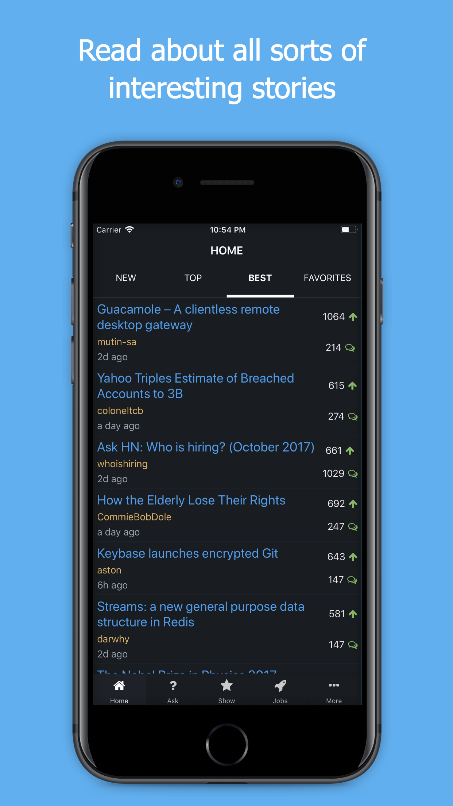
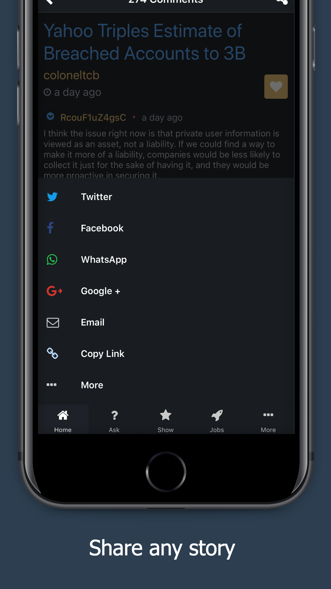
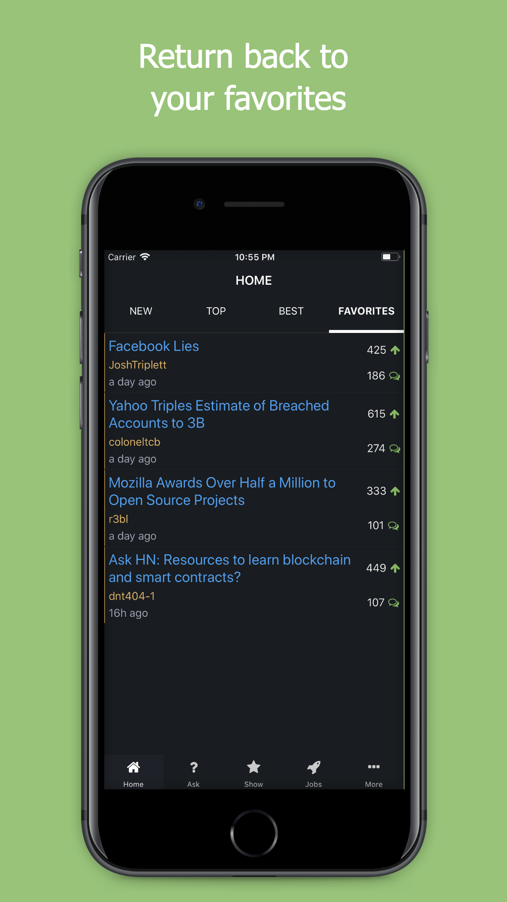
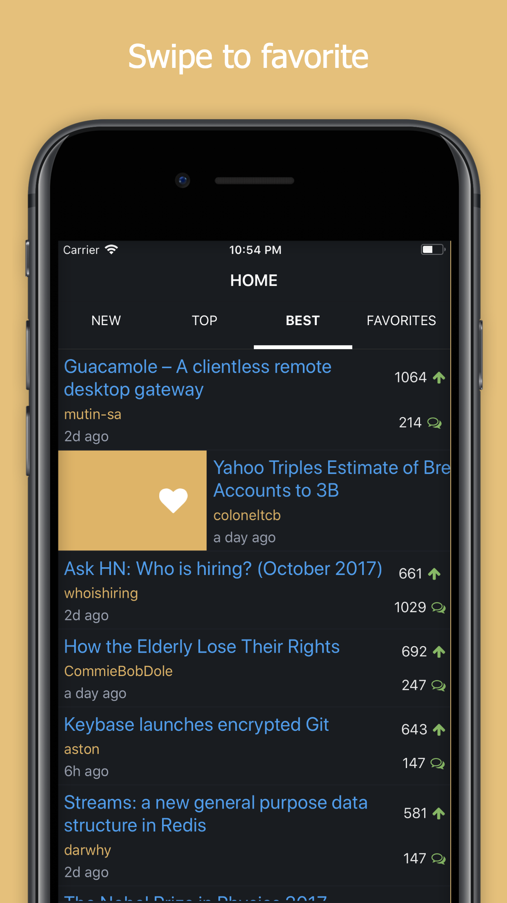
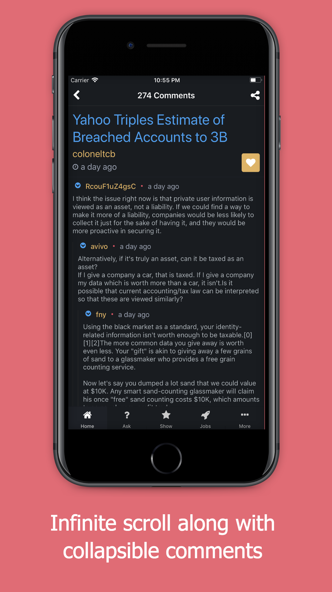

# HackerBuzz-ReactNative

Over the past few months, I've been working on a side project to gain an understanding of the React Native workflow. I decided to create a Hacker News reader using [Y Combinator's API](https://github.com/HackerNews/API).

### Available for iOS on the [App Store](https://itunes.apple.com/app/hacker-buzz/id1292825792?mt=8) and Android on the [Google Play Store](https://play.google.com/store/apps/details?id=com.hackerbuzz)

    

## Setup

1. Clone the repo
2. `$ cd HackerBuzz-ReactNative`
3. Run either `$ yarn install` or `$ npm install`

I used the [Facebook Audience Network](https://developers.facebook.com/products/audience-network/overview/) in order to display advertisements _every 20 stories_. As a result, you need to make sure that the SDK is properly installed or else the project won't build.

### iOS
1. Make sure that cocoapods are installed
   - `$ sudo gem install cocoapods`
2. `$ pod install`
3. Open `HackerBuzz.xcworkspace`
4. Modify `jsCodeLocation` to point to your IP address in `AppDelegate.m`
6. If you wish display ads, make sure that you create a placement within the Facebook Developer console or else they won't appear.
   - [Getting Started with the Facebook SDK](https://developers.facebook.com/docs/ios/getting-started/#settings)
   - [Getting Started with The Facebook Audience Network](https://developers.facebook.com/docs/audience-network)
   - Modify `kFacebookAdPlacementId` within `StoryListAd.m`
7. Run via XCode or `$ react-native run-ios`

### Android

1. Build the Android project
2. Add the Facebook SDK to the project [as per these instructions](https://developers.facebook.com/docs/android/getting-started/#sdk-project)
3. If you wish display ads, make sure that you create a placement within the Facebook Developer console or else they won't appear.
   - [Getting Started with the Facebook SDK](https://developers.facebook.com/docs/android/getting-started/#settings)
   - [Getting Started with The Facebook Audience Network](https://developers.facebook.com/docs/audience-network)
   - Modify `PLACEMENT_ID` within `RNTNativeAdManager.java`
4. Run via Android Studio

## Testing

The project currently contains test for the actions and reducers within `/js/__tests__/`. Mocks are located within `js/__mocks__/` In order to execute these tests, run `$ npm test`.

### Current Test Coverage

## Scripts

- `$ npm bundle-ios` - Bundle code for an iOS release build
- `$ npm bundle-android` - Bundle code for an Android release build
- `$ npm test` - Run unit tests
- `$ lint-fix` - Run linter

## Future Work

**Settings**
- [ ] Light Theme
- [ ] Specify Font Size

## Contributing and License

### Issues

Feel free to submit issues and enhancement requests.

### Contributing

1. Fork the repo on GitHub
2. Clone the project to your own machine
3. Commit changes to your own branch
4. Push your work back up to your fork
5. Submit a Pull request so that we can review your changes

### License

Released under the MIT License. Check `LICENSE.md` for more info.

## Donate

Any support would be highly appreciated! 🚀 🌕

- **BTC**: 1LCurQW9j7rP7uJYki2uW8RGFDJPujdvEt
- **ETH**: 0x6350726EfE25205ef3AE88f054a16d40091725B6
- **LTC**: LPvPMmqzBSDEjUmJcv2bXNUuc6cUWLnfoq
